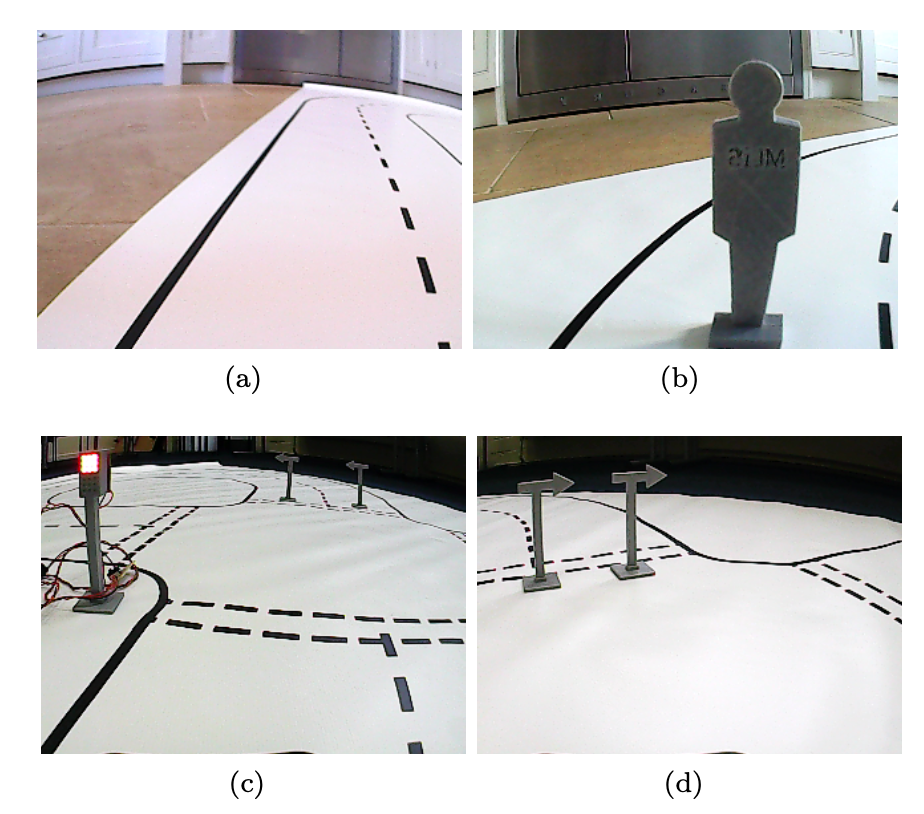
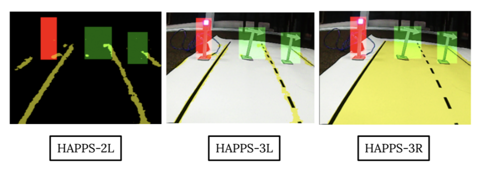

# Deep-Learning Approach to Autonomous Vehicles

Recent advances in artificial intelligence have led to a rapid explosion in self-driving cars based on deep-learning algorithms. Indeed, many major car industries, including Tesla, Ford, BMW, and GM, are actively testing and have demonstrated these cars can successfully drive millions of miles with- out any human intervention. Leveraging deep-learning methods (e.g., LaneNET, ENet, YOLOv3), we design, implement, and evaluate Simple AuDeep Driving System (SADS) and Helped AuDeep Premium Piloting System (HAPPS). Both models are based on NVIDIA’s end-to-end approach for autonomous driving system to map raw pixels from input images to make steering commands for a car. In the end, we compete in two competitions: kaggle board and live-testing in which a car based on the SADS model succesfully navigated across three realistic driving circuits.

# Examples of driving-scenes

# Different versions of our proposed models

